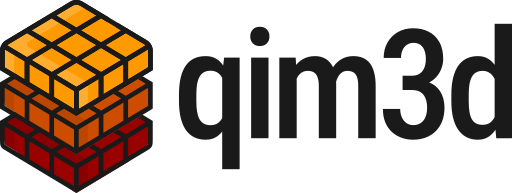
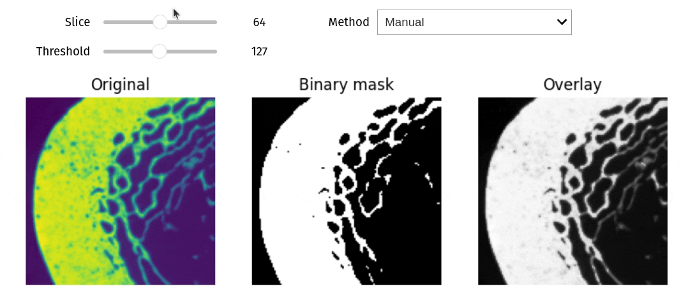
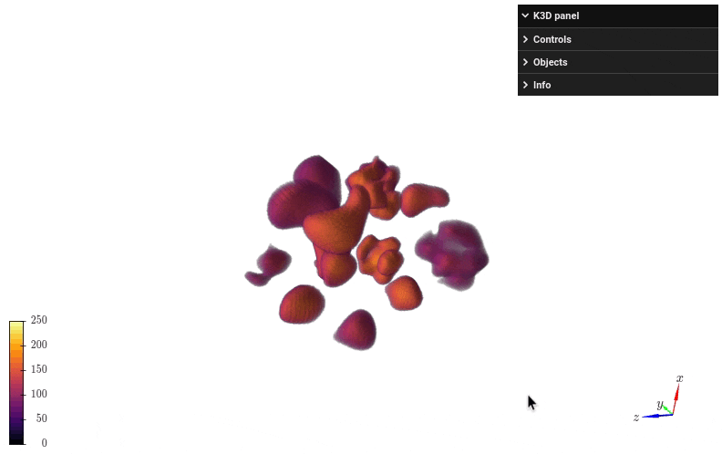
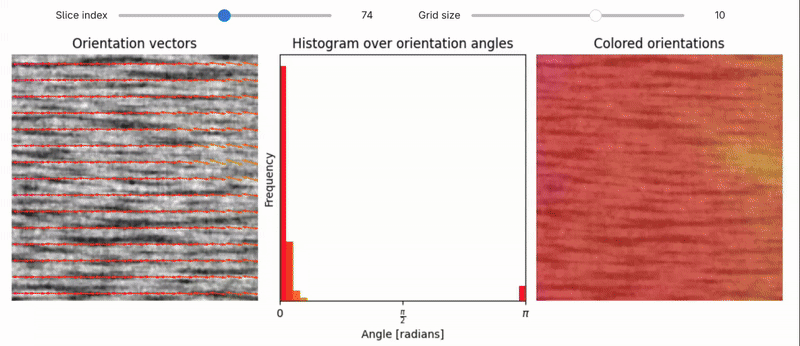

# Quantitative Imaging in 3D



[](https://badge.fury.io/py/qim3d)
[](https://pepy.tech/project/qim3d)

The `qim3d` (kɪm θriː diː) library is designed to make it easier to work with 3D imaging data in Python. It offers a range of features, including data loading and manipulation, image processing and filtering, visualization of 3D data, and analysis of imaging results.

You can easily load and process 3D image data from various file formats, apply filters and transformations to the data, visualize the results using interactive plots and 3D rendering, and perform quantitative analysis on the images.

Documentation available at https://docs.qim.dk/qim3d/

For more information on the QIM center visit https://qim.dk/

## Installation

`qim3d` is distributed via [pypi](https://pypi.org/project/qim3d/) and can be installed easily with:

```sh
# pip
pip install qim3d

# uv
uv add qim3d

# pixi
pixi add --pypi qim3d

# conda
conda create -n myqim3d python=3.14
conda activate myqim3d
pip install qim3d
```

Note that some features require you to install extra dependencies — you can use `qim3d[all]` to install all features. For more detailed instructions and troubleshooting, please refer to the [documentation](https://docs.qim.dk/qim3d/user_guide/installation/).

`qim3d` follows the [SPEC-0](https://scientific-python.org/specs/spec-0000/) recommendation for supported Python versions, currently: Python 3.12 – 3.14.

## Examples

### Interactive volume slicer

```python
import qim3d

vol = qim3d.examples.bone_128x128x128
qim3d.viz.slicer(vol)
```


### Line profile

```python
import qim3d

vol = qim3d.examples.bone_128x128x128
qim3d.viz.line_profile(vol)
```


### Threshold exploration
```python
import qim3d

# Load a sample volume
vol = qim3d.examples.bone_128x128x128

# Visualize interactive thresholding
qim3d.viz.threshold(vol)
```



### Synthetic data generation

```python
import qim3d

# Generate synthetic collection of volumes
num_volumes = 15
volume_collection, labels = qim3d.generate.volume_collection(num_volumes = num_volumes)

# Visualize the collection
qim3d.viz.volumetric(volume_collection)
```


### Structure tensor analysis

```python
import qim3d

vol = qim3d.examples.fibers_150x150x150
val, vec = qim3d.processing.structure_tensor(vol, visualize = True, axis = 1)
```


## Contributing

Please see the [Contributor Guide](/CONTRIBUTING.md).

## Support

The development of the `qim3d` is supported by the Infrastructure for Quantitative AI-based Tomography **QUAITOM** which is supported by a Novo Nordisk Foundation Data Science Programme grant (Grant number NNF21OC0069766).


