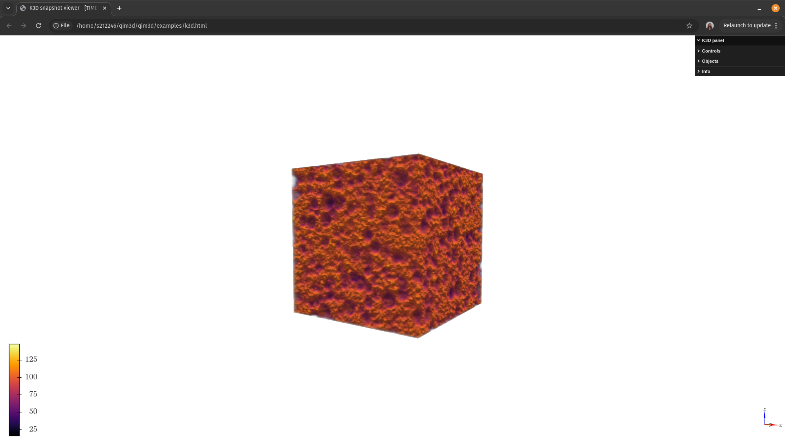

# Command line interface
The library also includes a command line interface for easy access to some functionalities, and the convenience of using qim3d directly from your terminal. 

This offers quick interactions, making it ideal for tasks that require efficiency or when certain functionalities need to run on a server. 

!!! Example
    ```bash
    qim3d gui --data-explorer
    ```
    


## Graphical User Interfaces

### `qim3d gui`
!!! quote "Reference"
    The GUIs available in `qim3d` are built using Gradio:
    <https://github.com/gradio-app/gradio>

    ```bibtex
    @article{abid2019gradio,
    title = {Gradio: Hassle-Free Sharing and Testing of ML Models in the Wild},
    author = {Abid, Abubakar and Abdalla, Ali and Abid, Ali and Khan, Dawood and Alfozan, Abdulrahman and Zou, James},
    journal = {arXiv preprint arXiv:1906.02569},
    year = {2019},
    }
    ```
| Arguments | Description |
| --------- | ----------- |
| `--data-explorer` | Starts the Data Explorer |
| `--iso3d` | Starts the 3D Isosurfaces visualization |
| `--local-thickness` | Starts the Local thickness tool |
| `--anotation-tool` | Starts the annotation tool |
| `--layers` | Starts the tool for segmenting layers |
| `--host` | Desired host for the server. By default runs on `0.0.0.0`  |
| `--platform` | Uses the Qim platform API for a unique path and port depending on the username |


!!! Example

    Here's an example of how to open the [Data Explorer](gui.md#data_explorer)

    ```
    qim3d gui --data-explorer
    ```
    ``` title="Output"
    Running on local URL:  http://127.0.0.1:7860
    ```

    In this case, the GUI will be available at `http://127.0.0.1:7860`

    


!!! Example

    Or for the local thickness GUI:

    ```
    qim3d gui --local-thickness --host 127.0.0.1 --platform
    ```

    ``` title="Output"
    {'username': 'fima', 'jupyter_port': '57326', 'gradio_port': '47326'}


    ╭────────────────────────╮
    │ Starting gradio server │
    ├────────────────────────╯
    ├ Gradio
    ├ Using port 47326
    ╰ Running at 10.52.0.158

    http://127.0.0.1:47326/gui/fima/47326/
    INFO:     Started server process [1534019]
    INFO:     Waiting for application startup.
    INFO:     Application startup complete.
    INFO:     Uvicorn running on http://127.0.0.1:47326 (Press CTRL+C to quit)

    ```

    In this case, the GUI will be available at `http://127.0.0.1:47326/gui/fima/47326/`

    


## Data visualization
The command line interface also allows you to easily visualize data.

### `qim3d viz`
!!! quote "Reference"
    Volumetric visualization uses K3D:
    [Github page](https://github.com/K3D-tools/K3D-jupyter)


It is possible to launch the k3d visualization directly from the command line.

| Arguments | Description |
| --------- | ----------- |
| `--source` | Path to the volume file (Any image format supported by `qim3d.io.load()`) |
| `--destination` | Path to the `html` file to be saved. By default, `k3d.html` is saved where the command is run. |
| `--no-browser` | Do not open the file when finished. |


!!! Example
    ```
    qim3d viz --source blobs_256x256x256.tif
    ```

    ``` title="Output"
    Loading data from blobs_256x256x256.tif
    Done, volume shape: (256, 256, 256)

    Generating k3d plot...
    Done, plot available at <k3d.html>
    Opening in default browser...
    ```
    And a new tab will be opened in the default browser with the interactive k3d plot:

    { width="512" }

Or an specific path for destination can be used. We can also choose to not open the browser:

!!! Example
    ```
    qim3d viz --source blobs_256x256x256.tif --destination my_plot.html --no-browser
    ```
    
    ``` title="Output"
    Loading data from blobs_256x256x256.tif
    Done, volume shape: (256, 256, 256)

    Generating k3d plot...
    Done, plot available at <my_plot.html>
    ```

    This writes to disk the `my_plot.html` file.

## File preview
Command line interface, which allows users to preview 3D structers or 2D images directly in command line.
###  `qim3d preview <filename>`
| Arguments | Description |
| --------- | ----------- |
| `--axis` | Specifies from which axis the slice will be taken. If the object is 2D image, then this is ignored. Defaults to 0.|
| `--slice` | Specifies which slice will be displayed. If the number exceeds number of slices, the last one is taken. Defaults to the middle slice.|
| `--resolution` | How many characters will be used to display the image in command line. Defaults to 80.|
| `--absolute_values` |If values are low the image might be just black square. By default maximum value is set to 255. This flag turns this behaviour off.|

!!! Example
    ```
    qim3d preview blobs_256x256x256.tif 
    ```

    { width="512" }

!!! Example
    ```
    qim3d preview blobs_256x256x256.tif --resolution 30
    ```

    { width="512" }

!!! Example
    ```
    qim3d preview blobs_256x256x256.tif --resolution 50 --axis 1
    ```

    { width="512" }

!!! Example
    ```
    qim3d preview blobs_256x256x256.tif --resolution 50 --axis 2 --slice 0
    ```

    { width="512" }

!!! Example
    ```
    qim3d preview qim_logo.png --resolution 40
    ```

    { width="512" }
