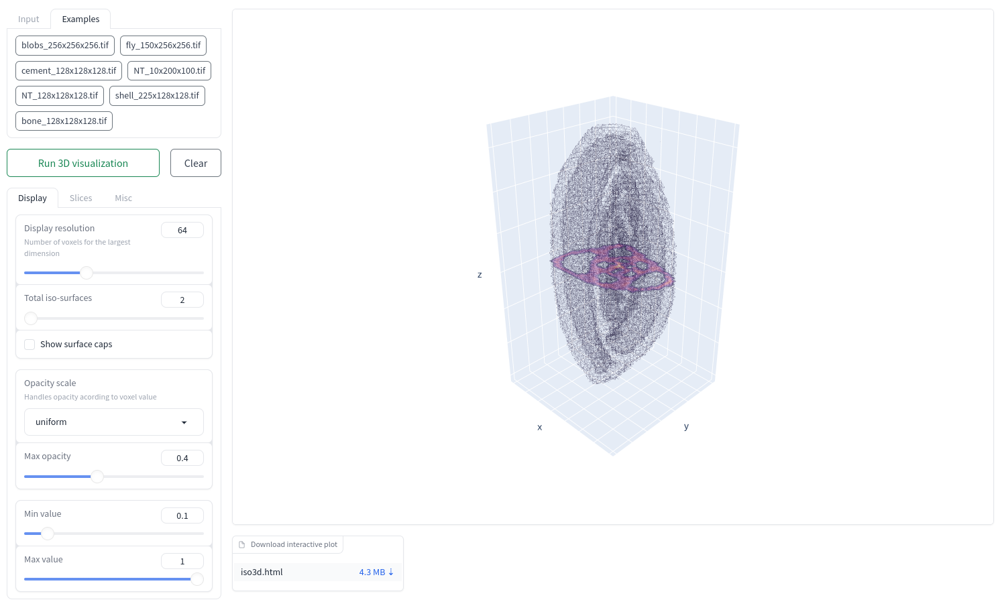

# Graphical User Interfaces

The `qim3d` library provides a set of custom made GUIs that ease the interaction with the available tools.

!!! quote "Reference"
    The GUIs available in `qim3d` are built using Gradio:
    <https://github.com/gradio-app/gradio>

    ```bibtex
    @article{abid2019gradio,
    title = {Gradio: Hassle-Free Sharing and Testing of ML Models in the Wild},
    author = {Abid, Abubakar and Abdalla, Ali and Abid, Ali and Khan, Dawood and Alfozan, Abdulrahman and Zou, James},
    journal = {arXiv preprint arXiv:1906.02569},
    year = {2019},
    }
    ```

In general, the GUIs can be launched directly from the command line. 
For details see [here](cli.md#qim3d-gui).

::: qim3d.gui.data_explorer
    options:
        members: False


::: qim3d.gui.local_thickness
    options:
        members: False


::: qim3d.gui.iso3d
    options:
        members: False


::: qim3d.gui.annotation_tool
    options:
        members: False

::: qim3d.gui.layers2d
    options:
        members: False