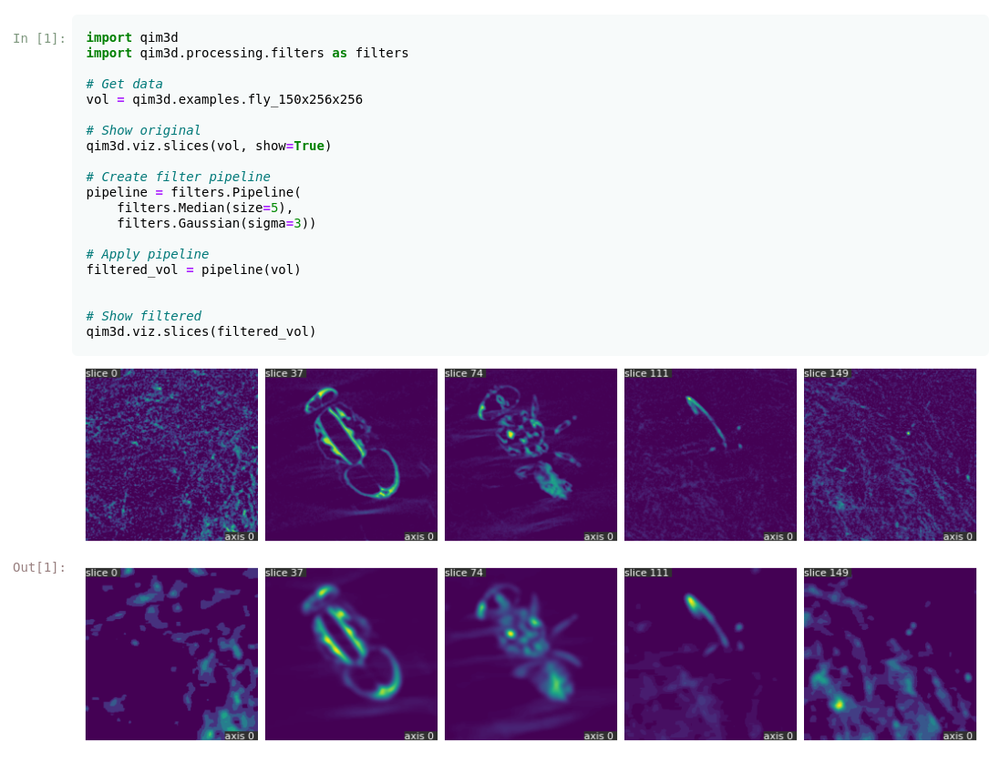

# { width="256" }

[](https://badge.fury.io/py/qim3d)
[](https://pepy.tech/project/qim3d)


The `qim3d` library is designed to make it easier to work with 3D imaging data in Python. It offers a range of features, including data loading and manipulation, image processing and filtering, visualization of 3D data, and analysis of imaging results.

You can easily load and process 3D image data from various file formats, apply filters and transformations to the data, visualize the results using interactive plots and 3D rendering, and perform quantitative analysis on the images.

Whether you are working with medical imaging data, materials science data, or any other type of 3D imaging data, `qim3d` provides a convenient and powerful set of tools to help you analyze and understand your data.


!!! Example
    ```python
    import qim3d
    import qim3d.processing.filters as filters

    # Get data
    vol = qim3d.examples.fly_150x256x256

    # Show original
    qim3d.viz.slices(vol, show=True)

    # Create filter pipeline
    pipeline = filters.Pipeline(
        filters.Median(size=5),
        filters.Gaussian(sigma=3))

    # Apply pipeline
    filtered_vol = pipeline(vol)


    # Show filtered
    qim3d.viz.slices(filtered_vol)
    ```
    

## Installation

Creating an `conda` environment is not required but recommended:
```
conda create -n qim3d python=3.11
```
After the environment is created, activate it by running:
```
conda activate qim3d
```


### Install using `pip`

The latest stable version can be simply installed using `pip`:

```
pip install qim3d
```

!!! note
    Installing `qim3d` may take a bit of time due to its dependencies. Thank you for your patience!

### Upgrade

The library is under constant development, so make sure to keep your installation updated:
```
pip install --upgrade qim3d
```

## Collaboration
Contributions to `qim3d` are welcome! 

If you find a bug, have a feature request, or would like to contribute code, please open an issue or submit a pull request.

You can find us at Gitlab:
[https://lab.compute.dtu.dk/QIM/tools/qim3d](https://lab.compute.dtu.dk/QIM/tools/qim3d
)

This project is licensed under the MIT License.


## Support

The development of `qim3d` is supported by:

{ width="256" }