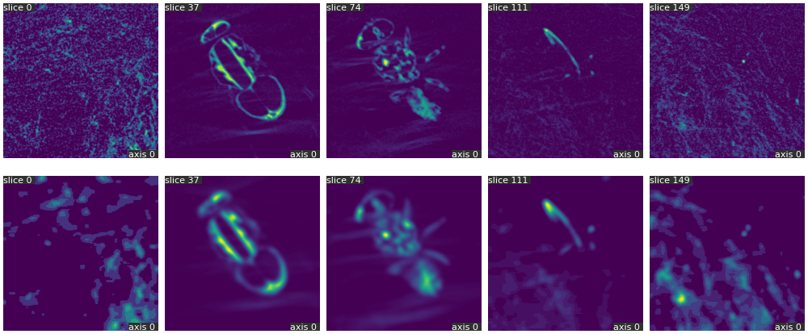

# { width="256" }

[](https://badge.fury.io/py/qim3d)
[](https://pepy.tech/project/qim3d)


The `qim3d` library is designed to make it easier to work with 3D imaging data in Python. It offers a range of features, including data loading and manipulation, image processing and filtering, visualization of 3D data, and analysis of imaging results.

You can easily load and process 3D image data from various file formats, apply filters and transformations to the data, visualize the results using interactive plots and 3D rendering, and perform quantitative analysis on the images.

Whether you are working with medical imaging data, materials science data, or any other type of 3D imaging data, `qim3d` provides a convenient and powerful set of tools to help you analyze and understand your data.


!!! Example
    ```python
    import qim3d
    import qim3d.processing.filters as filters

    # Get data
    vol = qim3d.examples.fly_150x256x256

    # Show original
    qim3d.viz.slices(vol, show=True)

    # Create filter pipeline
    pipeline = filters.Pipeline(
        filters.Median(size=5),
        filters.Gaussian(sigma=3))

    # Apply pipeline
    filtered_vol = pipeline(vol)


    # Show filtered
    qim3d.viz.slices(filtered_vol)
    ```
    

## Installation

Creating a `conda` environment is not required but recommended.


??? info "Miniconda installation and setup"

    [Miniconda](https://docs.anaconda.com/free/miniconda/index.html) is a free minimal installer for conda. 

    Here are some quick command line instructions to help you set up the latest Miniconda installer promptly. For graphical installers (.exe and .pkg) and instructions on hash checking, please refer to [Installing Miniconda](https://docs.anaconda.com/free/miniconda/miniconda-install/).

    === "Windows"
        These three commands quickly and quietly install the latest 64-bit version of the installer and then clean up after themselves. To install a different version or architecture of Miniconda for Windows, change the name of the `.exe` installer in the `curl` command.

        ```bash
        curl https://repo.anaconda.com/miniconda/Miniconda3-latest-Windows-x86_64.exe -o miniconda.exe
        start /wait "" miniconda.exe /S
        del miniconda.exe
        ```
        After installing, open the “Anaconda Prompt (miniconda3)” program to use Miniconda3. For the Powershell version, use “Anaconda Powershell Prompt (miniconda3)”.
    
    === "macOS"
        These four commands quickly and quietly install the latest M1 macOS version of the installer and then clean up after themselves. To install a different version or architecture of Miniconda for macOS, change the name of the `.sh` installer in the `curl` command.

        ```bash
        mkdir -p ~/miniconda3
        curl https://repo.anaconda.com/miniconda/Miniconda3-latest-MacOSX-arm64.sh -o ~/miniconda3/miniconda.sh
        bash ~/miniconda3/miniconda.sh -b -u -p ~/miniconda3
        rm -rf ~/miniconda3/miniconda.sh
        ```

        After installing, initialize your newly-installed Miniconda. The following commands initialize for bash and zsh shells:

        ```bash
        ~/miniconda3/bin/conda init bash
        ~/miniconda3/bin/conda init zsh
        ```

    === "Linux"
        These four commands quickly and quietly install the latest 64-bit version of the installer and then clean up after themselves. To install a different version or architecture of Miniconda for Linux, change the name of the `.sh` installer in the `wget` command.

        ```bash
        mkdir -p ~/miniconda3
        wget https://repo.anaconda.com/miniconda/Miniconda3-latest-Linux-x86_64.sh -O ~/miniconda3/miniconda.sh
        bash ~/miniconda3/miniconda.sh -b -u -p ~/miniconda3
        rm -rf ~/miniconda3/miniconda.sh
        ```

        After installing, initialize your newly-installed Miniconda. The following commands initialize for bash and zsh shells:

        ```bash
        ~/miniconda3/bin/conda init bash
        ~/miniconda3/bin/conda init zsh
        ```
Once you have `conda` installed, create a new enviroment:

```
conda create -n qim3d python=3.11
```
After the environment is created, activate it by running:
```
conda activate qim3d
```


### Install using `pip`

The latest stable version can be simply installed using `pip`:

```
pip install qim3d
```

!!! note
    Installing `qim3d` may take a bit of time due to its dependencies. Thank you for your patience!

### Upgrade

The library is under constant development, so make sure to keep your installation updated:
```
pip install --upgrade qim3d
```

## Collaboration
Contributions to `qim3d` are welcome! 

If you find a bug, have a feature request, or would like to contribute code, please open an issue or submit a pull request.

You can find us at Gitlab:
[https://lab.compute.dtu.dk/QIM/tools/qim3d](https://lab.compute.dtu.dk/QIM/tools/qim3d
)

This project is licensed under the [MIT License](https://lab.compute.dtu.dk/QIM/tools/qim3d/-/blob/main/LICENSE).

### Contributors

Below is a list of contributors to the project, arranged in chronological order of their first commit to the repository:

| Author                    |   Commits | First commit |
|:--------------------------|----------:|-------------:|
| Felipe Delestro           |       170 | 2023-05-12   |
| Stefan Engelmann Jensen   |        29 | 2023-06-29   |
| Oskar Kristoffersen       |        15 | 2023-07-05   |
| Christian Kento Rasmussen |        19 | 2024-02-01   |
| Alessia Saccardo          |         7 | 2024-02-19   |
| David Grundfest           |         4 | 2024-04-12   |
| Anna Bøgevang Ekner       |         3 | 2024-04-18   |

## Support

The development of `qim3d` is supported by:

{ width="256" }