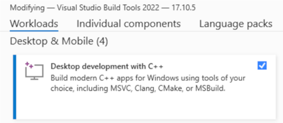

---
hide:
  - navigation
---

<link rel="stylesheet" href="https://cdnjs.cloudflare.com/ajax/libs/font-awesome/6.0.0-beta3/css/all.min.css">

<audio id="audio" src="assets/qim3d.mp3"></audio>

<script>
document.addEventListener("DOMContentLoaded", function() {
  const audio = document.getElementById("audio");
  const playButton = document.getElementById("playButton");

  playButton.addEventListener("click", function() {
    const icon = playButton.querySelector("i");
    if (audio.paused) {
      audio.play();
      icon.classList.remove("fa-circle-play");
      icon.classList.add("fa-circle-pause");
    } else {
      audio.pause();
      icon.classList.remove("fa-circle-pause");
      icon.classList.add("fa-circle-play");
    }
  });

  audio.addEventListener("ended", function() {
    const icon = playButton.querySelector("i");
    icon.classList.remove("fa-circle-pause");
    icon.classList.add("fa-circle-play");
  });
});
</script>

# { width="25%" }

[](https://badge.fury.io/py/qim3d)
[](https://pepy.tech/project/qim3d)

The **`qim3d`** (kɪm θriː diː <button id="playButton"><i class="fa-regular fa-circle-play"></i></button>)  library is designed for **Quantitative Imaging in 3D** using Python. It offers a range of features, including data loading and manipulation, image processing and filtering, data visualization, and analysis of imaging results.

You can easily load and process 3D image data from various file formats, apply filters and transformations to the data, visualize the results using interactive plots and 3D volumetric rendering.

Whether you are working with medical imaging data, materials science data, or any other type of 3D imaging data, `qim3d` provides a convenient and powerful set of tools to help you analyze and understand your data.

!!! Example "Interactive volume slicer"
    ```python
    import qim3d

    vol = qim3d.examples.bone_128x128x128
    qim3d.viz.slicer(vol)
    ```
    

!!! Example "Synthetic data generation"
    ```python
    import qim3d

    # Generate synthetic collection of blobs
    num_objects = 15
    volume_collection, labels = qim3d.generate.volume_collection(num_objects = num_objects)

    # Visualize the collection
    qim3d.viz.vol(volume_collection)
    ```
    <iframe src="https://platform.qim.dk/k3d/synthetic_collection_default.html" width="100%" height="500" frameborder="0"></iframe>

!!! Example "Structure tensor"
    ```python
    import qim3d

    vol = qim3d.examples.NT_128x128x128
    val, vec = qim3d.processing.structure_tensor(vol, visualize = True, axis = 2)
    ```

    

## Installation

### Create environment

Creating a `conda` environment is not required but recommended.

??? info "Miniconda installation and setup"

    [Miniconda](https://docs.anaconda.com/free/miniconda/index.html) is a free minimal installer for conda. 

    Here are some quick instructions to help you set up the latest Miniconda installer for your system: 

    === "Windows"

        The easiest way to install Miniconda on Windows is through the graphical interface installer. Follow these steps:

        1. Download the installer [here](https://repo.anaconda.com/miniconda/Miniconda3-latest-Windows-x86_64.exe).
        2. Run the installer and follow the on-screen instructions.
        3. When the installation finishes, open `Anaconda Prompt (miniconda3)` from the Start menu.
        
    
    === "macOS"
 
        The easiest way to install Miniconda on macOS is through the graphical interface installer. Follow these steps:

        1. Download the correct installer for your processor version. If you are unsure about your version, check [here](https://support.apple.com/en-us/116943).
            - For Intel processors, download [x86](https://repo.anaconda.com/miniconda/Miniconda3-latest-MacOSX-x86_64.pkg)
            - For Apple Silicon (M1/M2/M3 etc) processors, download [arm64](https://repo.anaconda.com/miniconda/Miniconda3-latest-MacOSX-arm64.pkg)

        2. Run the installer and follow the on-screen instructions.
        
    === "Linux"
        These four commands quickly and quietly install the latest 64-bit version of the installer and then clean up after themselves. To install a different version or architecture of Miniconda for Linux, change the name of the `.sh` installer in the `wget` command.

        ```bash
        mkdir -p ~/miniconda3
        wget https://repo.anaconda.com/miniconda/Miniconda3-latest-Linux-x86_64.sh -O ~/miniconda3/miniconda.sh
        bash ~/miniconda3/miniconda.sh -b -u -p ~/miniconda3
        rm -rf ~/miniconda3/miniconda.sh
        ```

        After installing, initialize your newly-installed Miniconda. The following commands initialize for bash and zsh shells:

        ```bash
        ~/miniconda3/bin/conda init bash
        ~/miniconda3/bin/conda init zsh
        ```
Once you have `conda` installed, open your terminal and create a new enviroment:

    conda create -n qim3d python=3.11

After the environment is created, activate it by running:

    conda activate qim3d

Remember, if you chose to create an environment to install `qim3d`, it needs to be activated each time before using the library.

### Install using `pip`

The latest stable version can be simply installed using `pip`. Open your terminal and run:

    pip install qim3d

!!! note
    The base installation of `qim3d` does not include deep-learning dependencies, keeping the library lighter for scenarios where they are unnecessary. If you need to use deep-learning features, you can install the additional dependencies by running: **`pip install qim3d['deep-learning']`**

After completing the installation, you can verify its success by running one or both of the following commands:

    qim3d

or:

    pip show qim3d

If either command displays information about the qim3d library, the installation was successful.

### Troubleshooting

Here are some solutions for commonly found issues during installation and usage of `qim3d`.

#### Failed building

Some Windows users could face an build error during installation.

??? Bug "ERROR: Failed building wheel for noise"
    ```
    Building wheels for collected packages: noise, outputformat, asciitree, ffmpy
    Building wheel for noise (setup.py) ... error
    error: subprocess-exited-with-error

    × python setup.py bdist_wheel did not run successfully.
    │ exit code: 1
    ╰─> [14 lines of output]
        running bdist_wheel
        running build
        running build_py
        creating build
        creating build\lib.win-amd64-cpython-311
        creating build\lib.win-amd64-cpython-311\noise
        copying perlin.py -> build\lib.win-amd64-cpython-311\noise
        copying shader.py -> build\lib.win-amd64-cpython-311\noise
        copying shader_noise.py -> build\lib.win-amd64-cpython-311\noise
        copying test.py -> build\lib.win-amd64-cpython-311\noise
        copying __init__.py -> build\lib.win-amd64-cpython-311\noise
        running build_ext
        building 'noise._simplex' extension
        error: Microsoft Visual C++ 14.0 or greater is required. Get it with "Microsoft C++ Build Tools": https://visualstudio.microsoft.com/visual-cpp-build-tools/
        [end of output]

    note: This error originates from a subprocess, and is likely not a problem with pip.
    ERROR: Failed building wheel for noise
    ```

This issue occurs because the system lacks the necessary tools to compile the library requirements. To resolve this, follow these steps:

- Go to the [Visual C++ Build Tools](https://visualstudio.microsoft.com/visual-cpp-build-tools/) page and click on "Download build tools."
- Run the installer and ensure that `Desktop development with C++` is checked. 
- Restart your computer
- Activate your conda enviroment and run `pip install qim3d` again

#### Get the latest version

The library is under constant development, so make sure to keep your installation updated:

    pip install --upgrade qim3d

## Collaboration

Contributions to `qim3d` are welcome!

If you find a bug, have a feature request, or would like to contribute code, please open an issue or submit a pull request.

You can find us at Gitlab:
[https://lab.compute.dtu.dk/QIM/tools/qim3d](https://lab.compute.dtu.dk/QIM/tools/qim3d
)

This project is licensed under the [MIT License](https://lab.compute.dtu.dk/QIM/tools/qim3d/-/blob/main/LICENSE).

### Contributors

Below is a list of contributors to the project, arranged in chronological order of their first commit to the repository:

| Author                      |   Commits | First commit |
|:----------------------------|----------:|-------------:|
| Felipe Delestro             |       254 | 2023-05-12   |
| Stefan Engelmann Jensen     |        29 | 2023-06-29   |
| Oskar Kristoffersen         |        15 | 2023-07-05   |
| Christian Kento Rasmussen   |        23 | 2024-02-01   |
| Alessia Saccardo            |        14 | 2024-02-19   |
| David Grundfest             |        19 | 2024-04-12   |
| Anna Bøgevang Ekner         |         7 | 2024-04-18   |
| David Diamond Wang Johansen |         2 | 2024-10-31   |
| Oscar Flensburg Clausen     |         5 | 2024-11-20   |
| Hans Martin Kjer            |         1 | 2024-12-02   |


## Support

The development of the `qim3d` is supported by the Infrastructure for Quantitative AI-based Tomography QUAITOM which is supported by a Novo Nordisk Foundation Data Science Programme grant (Grant number NNF21OC0069766).

{ width="148" }

{ width="256" }
