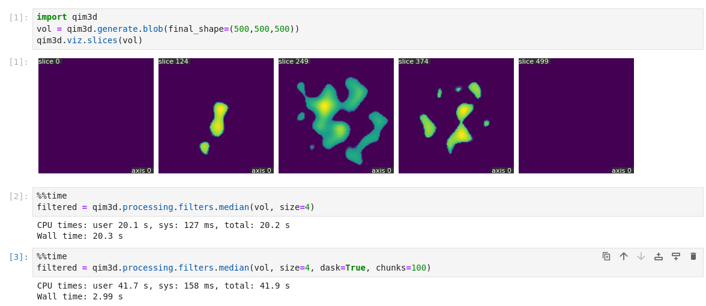

# Release History

Below, you'll find details about the version history of `qim3d`.

As the library is still in its early development stages, **there may be breaking changes** before `v1.0` without prior deprecation warnings. Therefore, it's advisable to review the release history for more information if you encounter any issues.

And remember to keep your pip installation [up to date](/qim3d/#get-the-latest-version) so that you have the latest features!

### v0.4.3 (02/10/2024)

- Updated requirements
- Introduction of mesh generation, visualization, saving and loading 🎉  

### v0.4.2 (30/09/2024)

- Export and import is now possible in the OME-Zarr standard, including multi-scale datasets.
- Filters now have the option to use Dask when available 

### v0.4.1 (30/07/2024)

- Fixed issue with example volumes not being loaded

### v0.4.0 (29/07/2024)

- Refactored imports to use lazy loading
- Namespace `utils` reserved for internal tools only
- All deep-learning related functions moved to `models`
- Running `pip install qim3d` does not install DL requirements. For those, use `pip install qim3d['deep-learning']` 

### v0.3.9 (24/07/2024)

- Loading and saving for Zarr files
- File convertion using the CLI, including Zarr
- Refactoring for the GUIs
- Color visualization for structure tensor 
- Refactoring for synthetic data generation, from `utils` to `generate`
- Introduction of `qim3d.generate.collection` 🎉 

### v0.3.8 (20/06/2024)

- Minor refactoring and bug fixes

### v0.3.7 (17/06/2024)

- Performance improvements when importing 
- Refactoring for blob detection 

### v0.3.6 (30/05/2024)

- Refactoring for performance improvement
- Welcome message for the CLI
- Introduction of `qim3d.processing.fade_mask` 🎉 

### v0.3.5 (27/05/2024)

- Added runtime and memory usage in the documentation
- Introduction of `qim3d.utils.generate_volume` 🎉 
- CLI refactoring, adding welcome message to the user 
- Introduction of `preview` CLI 🎉

### v0.3.4 (22/05/2024)

- Documentation for `qim3d.viz.plot_cc`
- Fixed issue with Annotation tool and recent Gradio versions
- New colormap: `qim3d.viz.colormaps.qim`, showcasing the Qim colors!
- Object separation using `qim3d.processing.operations.watershed`
- Added option to pass `dim_order` to `vol/vgi` files
- The 'Data Explorer' GUI now can load image sequences also
- Warning in case user tries to load a file larger than available memory
- Objects colormap now can enforce a `min_dist` between neighbor colors
- It is possible to load a directory with a sequence of PIL images
- Aspect ratio issue for k3d fixed

### v0.3.3 (11/04/2024)

- Introduction of `qim3d.viz.slicer` (and also `qim3d.viz.orthogonal` ) 🎉
- Introduction of `qim3d.gui.annotation_tool` 🎉
- Introduction of `qim3d.processing.Blob` for blob detection 🎉
- Introduction of `qim3d.processing.local_thickness` 🎉
- Introduction of `qim3d.processing.structure_tensor` 🎉
- Support for loading DICOM files with `qim3d.io.load`
- Introduction of `qim3d.processing.get_3d_cc` for 3D connected components and `qim3d.viz.plot_cc` for associated visualization 🎉
- Introduction of `qim3d.viz.colormaps` for easy visualization of e.g. multi-label segmentation results 🎉
- Introduction of `qim3d.processing.operations.background_removal` 🎉
- Documentation refactoring
- Fixed bug preventing `Data Explorer` to show files

### v0.3.2 (23/02/2024)

This version focus on the increased usability of the `qim3d` library

- Online documentation available at [https://platform.qim.dk/qim3d](https://platform.qim.dk/qim3d)
- Virtual stacks also available for `txm` files
- Updated GUI launch pipeline
- New functionalities for `qim3d.viz.slices`
- Introduction of `qim3d.processing.filters` 🎉 
- Introduction of `qim3d.viz.vol` 🎉 

### v0.3.1 (01/02/2024)

Release expanding the IO functionalities

- Support for loading `vol` `nii` and `bigtiff` files
- Data loader now supports `virtual_stack`
- Save functionality for all file formats except `txm`

### v0.3.0 (23/01/2024)
- Introduction of qim3d CLI 🎉 
- Introduction of memory utils 🎉 
- Data Explorer GUI
- Save functionality for `tif` files

### v0.2.0 (18/09/2023)

Includes new develoments toward the usability of the library, as well as its integration with the QIM platform.

- Refactored code for the graphical interfaces
    - For the local thicknes GUI, now it is possible to pass and receive numpy arrays instead of using the upload functionality.
- Improved data loader
    - Now the extensions `tif`, `h5` and `txm` are supported.
- Added `qim3d.viz.slices` for easy slice visualization.
- U-net model creation
    - Model availabe from `qim3d.models.UNet`
    - Data augmentation class at `qim3d.utils.Augmentation`
    - Notebook with full pipeline at `docs/notebooks/Unet.ipynb`
- Image examples accessible from `qim3d.examples`

### v0.1.3 (17/05/2023)

First stable release.

- Simple Tiff data loader
- Graphical interfaces
    - Local thickness
    - 3D Isosurfaces
    - Data exploration tool