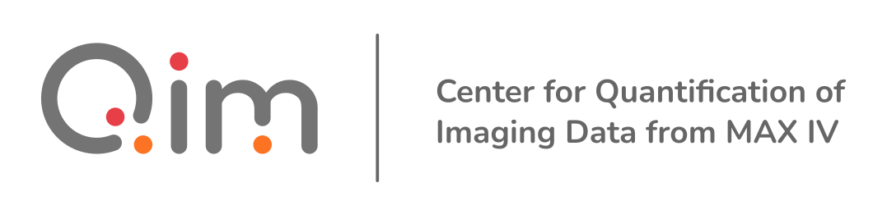

# Support

The development of the `qim3d` is supported by the Infrastructure for Quantitative AI-based Tomography QUAITOM which is supported by a Novo Nordisk Foundation Data Science Programme grant (Grant number NNF21OC0069766).

{ width="256px"}
{ width="512px"  style="margin-left: 64px;"  }

