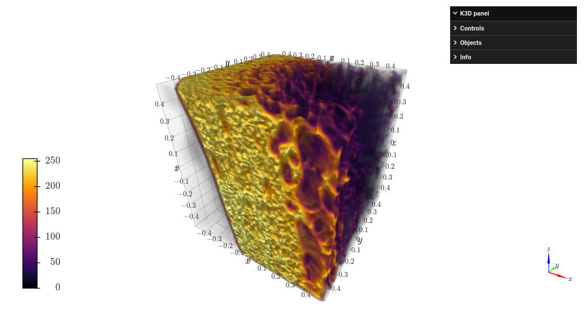

# Data visualization
The `qim3d`libray aims to provide easy ways to explore and get insights from volumetric data. 

!!! Example
    ```python
    import qim3d

    img = qim3d.examples.shell_225x128x128
    qim3d.viz.slices(img, n_slices=15)
    ```

    


!!! Example
    ```python
    import qim3d

    vol = qim3d.examples.bone_128x128x128
    qim3d.viz.vol(vol) 
    ```
    

::: qim3d.viz.img
    options:
        members:
            - slices

::: qim3d.viz.k3d
    options:
        members:
            - vol
