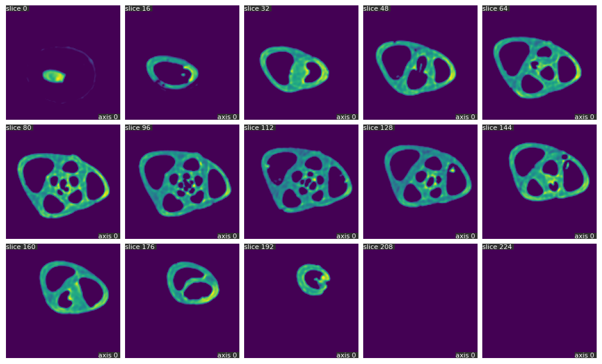
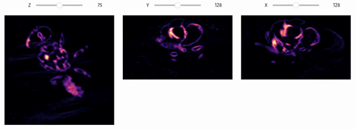

# Data visualization
The `qim3d`libray aims to provide easy ways to explore and get insights from volumetric data. 

!!! Example
    ```python
    import qim3d

    img = qim3d.examples.shell_225x128x128
    qim3d.viz.slices(img, n_slices=15)
    ```

    


!!! Example
    ```python
    import qim3d

    vol = qim3d.examples.bone_128x128x128
    qim3d.viz.slicer(vol)
    ```
    


!!! Example
    ```python
    import qim3d

    vol = qim3d.examples.fly_150x256x256
    qim3d.viz.orthogonal(vol, cmap="magma")
    ```
    


!!! Example
    ```python
    import qim3d

    vol = qim3d.examples.bone_128x128x128
    qim3d.viz.vol(vol) 
    ```

    <iframe src="https://platform.qim.dk/k3d/fima-bone_128x128x128-20240221113459.html" width="100%" height="500" frameborder="0"></iframe>
::: qim3d.viz.img
    options:
        members:
            - slices
            - slicer
            - orthogonal

::: qim3d.viz.k3d
    options:
        members:
            - vol
